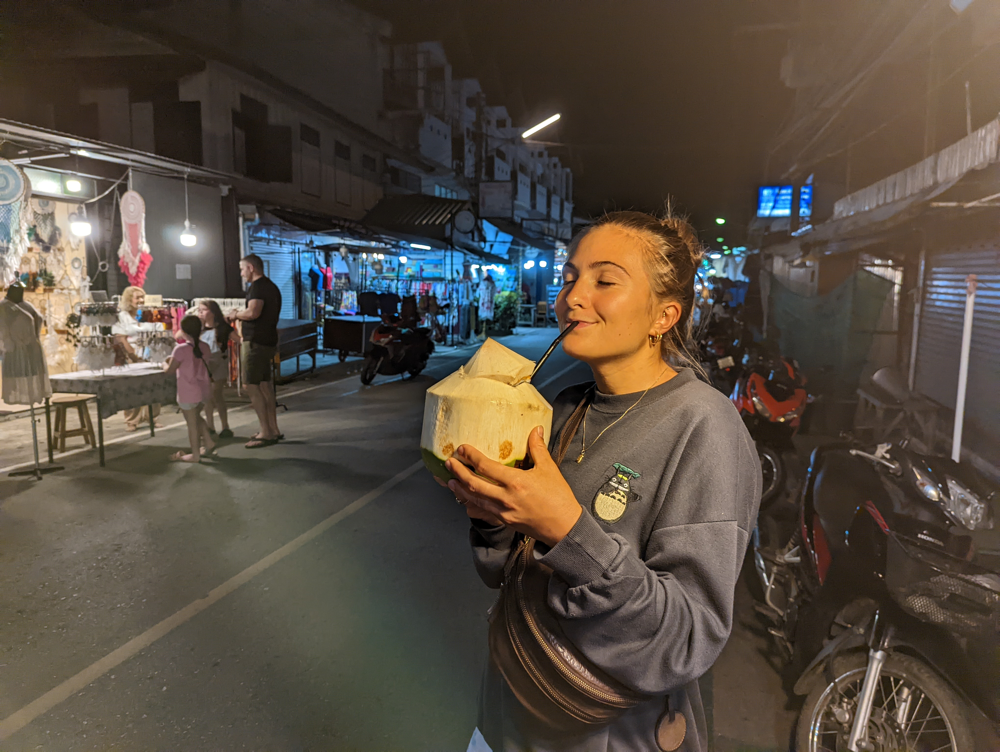

 

# Chapter 1: How to make a basic site like this

So, how to make a site like this, you ask?
Let me explain what I learned so far. 
The page you see right now is made with an easy and lightweight language called **Markdown**.
You can write your own pages by using a plain text editor like **[MacDown](http://macdown.uranusjr.com/download/latest/)**.
Alternatively, you can also use a complete badass editor to master your blog.
I would suggest that you use **[Viusal Studio](https://visualstudio.microsoft.com/de/vs/mac/)**.

You know what? Do not use macdown.
I think you are smart enough for the real shit. 
Use this viusal studio thing up there &#8593;.

In the beginning of our project you will probably start to get to know the markdown language.
But you will see that it is fairly simple to "code".

So your first exercise is to create a site like this where you try out some cool Markdown features.
You can start by making a new homepage. 
For this you need to locate the file `content/_index.md`.
Then you are ready to try out some markdown.

You could try:
- Making lists (lol)
- Including graphics like pictures
- `highlighting something`
- making a table
- [Hyperlinks](http://www.hyper-link.org)
- and there is much more. Find it out on the internet

  I know at some moments you will think: "Schmiiischmaa, help mee"

  {{}}

| Skill/Person      |   Schmazl    |               Klinka |
|:------------------|:------------:|---------------------:|
| Erbsen zählen     |     Noob     |                  Pro |
| U-Boote versenken |     k.p      |         Intermediate |
| Web Seiten Schreiben     | gerade gelernt | SCHMISCHMAAA, HELP ME |

But don't let the worry catch you.
Google and I are ready and very happy to help you then.

If you want to make something like hyperlinks, just google it.
When I google `hyperlinks markdown`. [This](https://anvilproject.org/guides/content/creating-links) appears.
Here are some [nice Markdown examples](https://markdown-it.github.io/#fnref2)

Easy, right?

Believe me, soon you will rock that thing as easy as Klinka sipping a coconut in Thailand.

{{}}

Okay enough of the Abschwuffing!! 
### Time for chapter two !

---

# Chapter 2: Include your new site(s)

In this chapter you will be learning how to use your environment.
Preferably, you have installed Visual Studio.
There you have your whole project and I will show you everything you need step by step.

I would put some more information but I gotta pee really bad.

# Chapter 3: Choose a theme

The easyiest way to make a beautiful theme is to download one of the hugo site.
Here it is: [hugo themes](https://jamstackthemes.dev/ssg/hugo/). 

I will integrate it for you.

# Chapter 4: Publish to the internet

Here we will figure out a cool domain for your blog.
I will buy it and try to integrate your site to the internet.

So it is actually done for you.
If you made it that far, congratulations! 
You are an official badass.
Join your badass hacker friends and celebrate!

{{}}

schmischmaaa hallo wollen wir jetzt unseren Tag planen ? 
aber mit dem Whiteboard bitte ! 
``bitte!``

